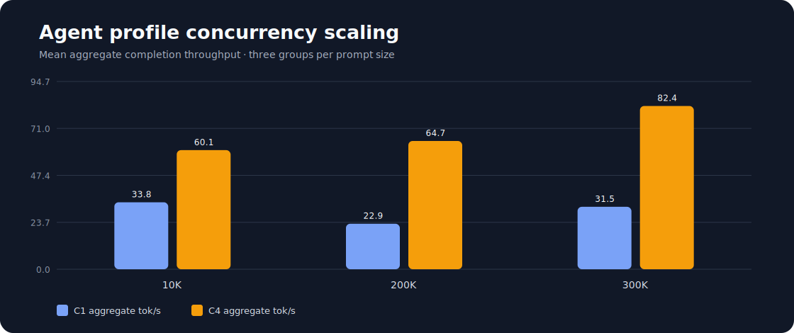

# Dual-Spark optimizations

Reproducible two-node inference for the gated
[`drowzeys/DeepSeek-V4-Flash-DSpark-Abliterated-Uncensored-v1.1-alpha-Mida-Brikie`](https://huggingface.co/drowzeys/DeepSeek-V4-Flash-DSpark-Abliterated-Uncensored-v1.1-alpha-Mida-Brikie)
weights on two NVIDIA DGX Sparks.

This project tests a deliberate “best of both worlds” combination:

- drowzeys / keys' v1.1 weights, which retain stock MTP heads and are intended
  to behave better with Mida, Brikie, Hermes, and tool-using agents;
- Tony Deangelo's fast, self-contained DSpark/vLLM overlay and worker-first
  two-node launch pattern;
- NVIDIA's supported direct 200GbE CX-7/RoCE topology;
- a download-once workflow: Forge downloads the ~155 GiB gated snapshot and
  transfers it directly to Anvil over the CX-7 link.

The hybrid has now been measured on Forge and Anvil with the pinned v1.1 model.
Fast C1 decode ranged from 36.79 tok/s at 10K to 57.29 tok/s at 300K. Agent C4
aggregate throughput ranged from 60.10 to 82.37 tok/s. These local results are
not directly comparable to upstream numbers collected with other weights,
prompts, output lengths, or runtime builds.

The compatibility boundary and benchmark hypothesis are detailed in
[`docs/DESIGN.md`](docs/DESIGN.md).

## Topology

| Role | Hostname | User | CX-7 interface | HCA | Fabric IP |
| --- | --- | --- | --- | --- | --- |
| head / download / API | `forge` | `jun` | `enp1s0f0np0` | `rocep1s0f0` | `10.100.10.1` |
| worker | `anvil` | `jun` | `enp1s0f1np1` | `rocep1s0f1` | `10.100.10.2` |

The hostnames do **not** need to match. NVIDIA's prerequisite is the same
username on both systems; here that user is `jun`.

Tailscale is for remote management. Model transfer and NCCL traffic stay on the
direct CX-7 link.

The live link reports 200,000 Mb/s full duplex. The validation run measured
95.35 Gb/s forward and 90.36 Gb/s reverse with TCP/iperf3, plus 108.98 Gb/s
with RDMA writes. See [`results/FABRIC.md`](results/FABRIC.md) and its linked
raw evidence.
The one-time encrypted rsync/SSH model copy also used this interface, as forced
by its `10.100.10.2` destination; it copied 173,766,905,451 bytes in 536 seconds
(0.302 GiB/s). That application-level rate is not the cable's capacity.

## Profiles

| Profile | Runtime | Context | Sequences | KV cache | Purpose |
| --- | --- | ---: | ---: | --- | --- |
| `fast` | Tony-derived overlay | 900,000 | 1 | `fp8` | Experimental best single-stream tok/s candidate |
| `agent` | drowzeys stage-c | 1,048,576 | 4 | `nvfp4_ds_mla` | Published v1.1-style agent/concurrency reference |

The stage-c reference follows drowzeys' privileged-container launch. The fast
profile remains unprivileged. Review this distinction before deploying on a
shared or untrusted host.

Tony reported a 62.48 tok/s mean on the stock model with his single-stream
profile. drowzeys reported about 50 tok/s C1 and 113 tok/s aggregate C4 with
v1.1 and stage-c. Those are upstream reference points, not results from this
repository.

## Measured results

All cases use the same pinned v1.1 weights and 256-token output cap. C1 is three
sequential requests. C4 is three groups of four simultaneous requests. Because
the runtime reported prefix-cache hits for repeated identical prompts, TTFT
includes a full-prefill first request and cache-assisted repeats; decode and
aggregate throughput are the primary comparison metrics.

| Profile | Prompt | C1 decode tok/s | C1 aggregate tok/s | C4 aggregate tok/s |
| --- | ---: | ---: | ---: | ---: |
| `fast` | 10K | 36.79 | 30.86 | — |
| `fast` | 200K | 49.88 | 24.52 | — |
| `fast` | 300K | 57.29 | 31.07 | — |
| `agent` | 10K | 35.30 | 33.78 | 60.10 |
| `agent` | 200K | 36.94 | 22.94 | 64.70 |
| `agent` | 300K | 53.77 | 31.50 | 82.37 |

The current default remains `fast` for single-stream long-context decode. Use
`agent` when four-way concurrency, the full 1M context configuration, or the
drowzeys stage-c behavior is the priority.




The complete table, TTFT values, exact model revision, and linked raw JSON are
in [`results/BENCHMARKS.md`](results/BENCHMARKS.md).

## Prerequisites

- Two DGX Sparks joined by one QSFP cable; `ibdev2netdev` must show one active
  lowercase `enp1...` interface on each node.
- Ubuntu 24.04, Docker, Docker Compose, `rsync`, and passwordless Windows-to-node
  SSH.
- The same Linux username on both nodes (`jun`).
- Access accepted for the gated Hugging Face model. The weights' responsible-use
  agreement and upstream DeepSeek license apply.
- `sudo` access for the one-time fabric and Tailscale setup.

## 1. Clone on Forge

```bash
git clone https://github.com/neko-legends/dual-spark-optimizations.git
cd dual-spark-optimizations
cp .env.example .env
```

The checked-in defaults match Forge and Anvil above. Review `.env`; never place
an HF token in it.

## 2. Configure the direct fabric

Before network or Tailscale enrollment, confirm `/etc/machine-id` differs on
the two physical nodes. If a cloned factory image left them identical, run on
Anvil only, review the printed old/new IDs, and reboot:

```bash
sudo ./scripts/regenerate-machine-id.sh anvil
sudo reboot
```

The script refuses to run on a hostname other than the one supplied and backs
up the previous ID under `/root`.

Bootstrap required packages and grant `jun` access to Docker on each node:

```bash
sudo ./scripts/bootstrap-host.sh
```

Reconnect afterward so the new Docker group membership takes effect. Anvil's
machine-ID reboot also satisfies this requirement. Membership in the Docker
group is effectively root-equivalent; grant it only to the trusted deployment
account.

Run on Forge:

```bash
sudo ./scripts/setup-fabric.sh head enp1s0f0np0
```

Run on Anvil:

```bash
sudo ./scripts/setup-fabric.sh worker enp1s0f1np1
```

This creates `/etc/netplan/40-dual-spark.yaml`, backs up an existing file of
that name, and assigns `10.100.10.1/24` and `10.100.10.2/24`. It does not alter
the normal LAN interface.

## 3. Configure Forge-to-Anvil SSH

From Forge:

```bash
./scripts/setup-inter-node-ssh.sh jun@10.100.10.2
./scripts/preflight.sh
./scripts/benchmark-fabric.sh
```

Host keys identify machines; user keys authenticate users. Do not copy private
keys between nodes.

## 4. Optional Tailscale management

Run on each Spark:

```bash
sudo ./scripts/install-tailscale.sh
```

Open the printed URL and join the same tailnet as your other devices. Do not use
Tailscale addresses for NCCL or the 155 GiB model copy.

## 5. Authenticate and download once

Accept the model's gate in a browser. On Forge, the first invocation creates a
small local Python environment and tells you how to authenticate if necessary:

```bash
./scripts/prepare-model.sh
```

After authentication, rerun it. The script downloads and verifies all 48 model
shards on Forge, then `rsync`s the verified local directory to Anvil over
`10.100.10.2`. Anvil never contacts Hugging Face for the weights.
The snapshot revision is pinned in `.env`; reviewed upstream revisions are in
[`UPSTREAM_VERSIONS.md`](UPSTREAM_VERSIONS.md).

## 6. Prepare a runtime and launch

Select a profile in `.env`, then:

```bash
./scripts/prepare-runtime.sh
./scripts/start.sh
```

The runtime image is pulled/built once on Forge and streamed to Anvil. The
worker starts first, followed by the head. The OpenAI-compatible API is at
`http://127.0.0.1:8888/v1` on Forge.

To reach the loopback-only API securely from Windows:

```powershell
ssh -L 8888:127.0.0.1:8888 forge
```

Then use `http://127.0.0.1:8888/v1` locally.

## 7. Benchmark both profiles

```bash
BENCHMARK_RUNS=3 ./scripts/run-benchmark-suite.sh
./scripts/stop.sh
```

The default suite runs the shared deterministic 10K, 200K, and 300K
technical-novel prompts at C1 and records streaming TTFT, decode tok/s,
end-to-end tok/s, server-returned token counts, runtime image metadata, and
before/after Prometheus metrics. The fixtures and checksums are documented in
[`benchmarks/prompts/README.md`](benchmarks/prompts/README.md).

For the `agent` profile's full C4 matrix:

```bash
BENCHMARK_RUNS=3 FULL_CONCURRENCY=1 ./scripts/run-benchmark-suite.sh
```

Change `PROFILE=agent` (or `fast`) in `.env`, rerun
`scripts/prepare-runtime.sh` and `scripts/start.sh`, then repeat the same
benchmark. Record prompt shape, output length, context occupancy, concurrency,
runtime image digest, and model revision with every published result.

The included benchmark is a quick smoke comparison, not a replacement for the
upstream stable-prompt harness.

After both profiles have been measured, render the tracked summary and chart:

```bash
python3 scripts/render-benchmark-report.py
```

Full transient captures remain ignored. Curated reports, telemetry, image
metadata, speculative metric deltas, the reproducible summary, and the chart
are checked in under `results/`; prompt text is not duplicated in those raw
artifacts.

The complete implementation and release gate is tracked in
[`TODO.md`](TODO.md); agents should update it as evidence is collected.

## Responsible use

The selected model has had safety refusals deliberately reduced. It is gated by
its publisher and is intended for responsible research, evaluation, red
teaming, and local use with user-supplied guardrails. Do not deploy it publicly
without an application-level safety layer and access controls. Follow the
model's gate, responsible-use terms, and all applicable laws.

## Credits

This repository exists because of work by drowzeys / keys, Tony Deangelo,
Rafael Caricio, MiaAI-Lab, the vLLM contributors, NVIDIA's DGX Spark team, and
the upstream DeepSeek team. Exact links, derived-file scope, and preserved
licenses are in [`THIRD_PARTY_NOTICES.md`](THIRD_PARTY_NOTICES.md).

Software in this repository is MIT licensed unless a file says otherwise.
Model weights are separately licensed and are not redistributed here.
Model weights, Hugging Face caches, runtime-image exports, and raw benchmark
captures are ignored and rejected by the repository artifact guard.
