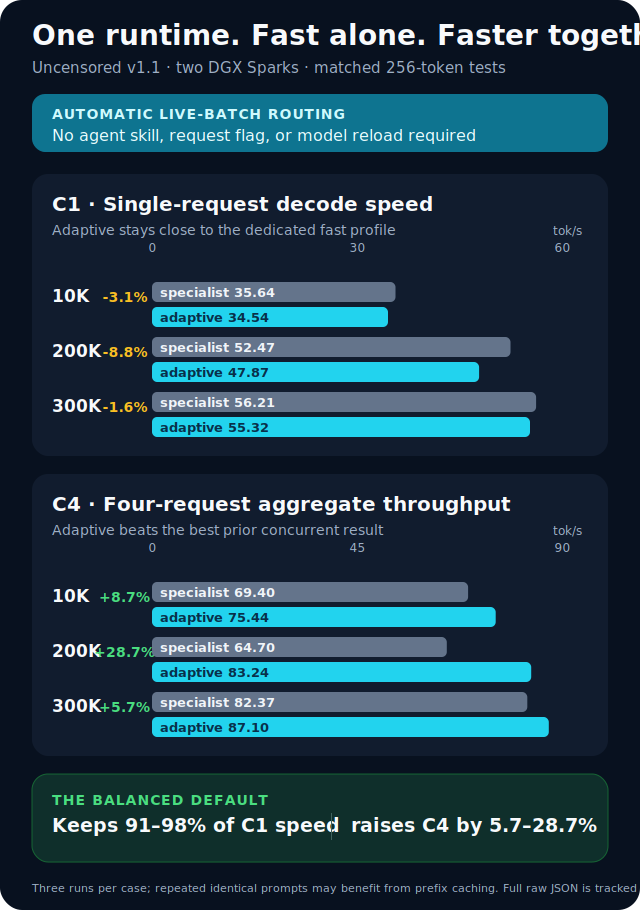
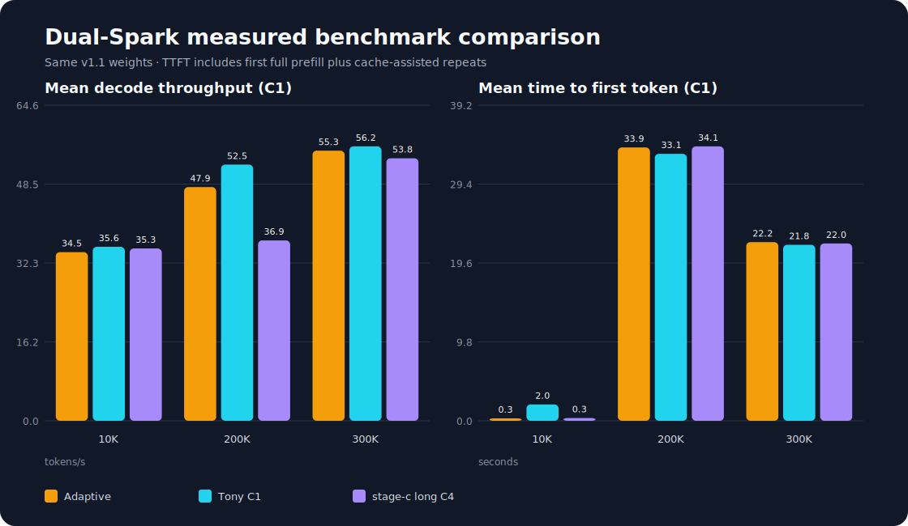

# Fast uncensored inference on two DGX Sparks

## Why this repository exists

This repository combines two complementary open-source projects into one
reproducible configuration:

- the gated, abliterated/uncensored v1.1 weights from drowzeys / keys; and
- Tony Deangelo's high-throughput DSpark/vLLM runtime optimizations.

The result is fast two-node inference with the uncensored model—not a stock
model substituted for benchmark speed. It also ports drowzeys' ragged-batch
and stable DSpark KV-slot work into Tony's fast overlay, making the combined
runtime genuinely C4-capable instead of merely queueing four requests.

**Measured conclusion:** use `PROFILE=adaptive` as the one-server default. It
automatically preserves the single-request hot path and switches to safe C4
batching as requests overlap; agents keep using the normal OpenAI-compatible
API with no skill, flag, or model reload.



### Why the adaptive profile matters

The full baseline comparison makes the compromises visible: the dedicated
`fast` profile wins C1 but cannot run true C4, while `long-c4` loses substantial
single-request speed in some cases. `adaptive` avoids those extremes while
accepting concurrent work automatically.



Every profile uses the same uncensored v1.1 weights, tool parser, and reasoning
parser. Pick the serving profile for the workload:

| Workload | Use | Measured reason |
| --- | --- | --- |
| General use: one to four active requests | `PROFILE=adaptive` | Within 1.6–8.8% of the C1 specialist and fastest measured C4 at every tested context |
| Dedicated single-request service | `PROFILE=fast` | Fastest C1 decode at 10K, 200K, and 300K |
| Full 1M configuration | `PROFILE=long-c4` | Retains the stage-c 1,048,576-token configuration |

There is deliberately no profile named `agent`: a runtime profile does not
make the model more agentic. Most users and AI-agent servers should start with
`adaptive`. No client skill or request flag is needed—the server selects Tony's
row-zero hot path for a lone request and stable-slot batching when requests
overlap.

The model used by every profile is
[`drowzeys/DeepSeek-V4-Flash-DSpark-Abliterated-Uncensored-v1.1-alpha-Mida-Brikie`](https://huggingface.co/drowzeys/DeepSeek-V4-Flash-DSpark-Abliterated-Uncensored-v1.1-alpha-Mida-Brikie)
on two NVIDIA DGX Sparks.

This project tests a deliberate “best of both worlds” combination:

- drowzeys / keys' v1.1 weights, which retain stock MTP heads and are intended
  to behave better with Mida, Brikie, Hermes, and tool-using agents;
- Tony Deangelo's fast, self-contained DSpark/vLLM overlay and worker-first
  two-node launch pattern;
- NVIDIA's supported direct 200GbE CX-7/RoCE topology;
- a download-once workflow: the head node downloads the ~155 GiB gated
  snapshot and transfers it directly to the worker over the CX-7 link.

The hybrid has now been measured on a two-Spark cluster with the pinned v1.1
model. Adaptive C1 decode ranged from 34.54 tok/s at 10K to 55.32 tok/s at
300K, while adaptive C4 aggregate throughput ranged from 75.44 to 87.10 tok/s.
These local results are
not directly comparable to upstream numbers collected with other weights,
prompts, output lengths, or runtime builds.

The compatibility boundary and benchmark hypothesis are detailed in
[`docs/DESIGN.md`](docs/DESIGN.md).

Hostnames and interface names are intentionally not prescribed or published.
Set them in the ignored `.env` after discovering each machine's active CX-7
interface and HCA. The two systems need the same Linux username, not the same
hostname. Tailscale is for remote management; model transfer and NCCL stay on
the direct CX-7 link.

The live link reports 200,000 Mb/s full duplex. The validation run measured
95.35 Gb/s forward and 90.36 Gb/s reverse with TCP/iperf3, plus 108.98 Gb/s
with RDMA writes. See [`results/FABRIC.md`](results/FABRIC.md) and its linked
raw evidence.
The one-time encrypted rsync/SSH model copy also used this interface, as forced
by its `10.100.10.2` destination; it copied 173,766,905,451 bytes in 536 seconds
(0.302 GiB/s). That application-level rate is not the cable's capacity.

## Profiles

| Profile | Runtime | Context | Sequences | KV cache | Purpose |
| --- | --- | ---: | ---: | --- | --- |
| `adaptive` | Tony overlay + drowzeys concurrency port | 900,000 | 4 | `fp8` | **Recommended:** automatically optimizes one to four active requests |
| `fast` | Tony-derived overlay | 900,000 | 1 | `fp8` | C1 specialist, especially when every tok/s matters at 200K |
| `long-c4` | drowzeys stage-c | 1,048,576 | 4 | `nvfp4_ds_mla` | Full 1M stage-c configuration |

The stage-c `long-c4` profile follows drowzeys' privileged-container launch.
The Tony-derived profiles remain unprivileged. Users selecting `adaptive` or
`fast` do not pull/install stage-c.

Tony reported a 62.48 tok/s mean on the stock model with his single-stream
profile. drowzeys reported about 50 tok/s C1 and 113 tok/s aggregate C4 with
v1.1 and stage-c. Those are upstream reference points, not results from this
repository.

## Measured results

All cases use the same pinned v1.1 weights and 256-token output cap. C1 is three
sequential requests. C4 is three groups of four simultaneous requests. Because
the runtime reported prefix-cache hits for repeated identical prompts, TTFT
includes a full-prefill first request and cache-assisted repeats; decode and
aggregate throughput are the primary comparison metrics.

| Profile | Prompt | C1 decode tok/s | C1 aggregate tok/s | C4 aggregate tok/s |
| --- | ---: | ---: | ---: | ---: |
| `adaptive` | 10K | 34.54 | 33.30 | **75.44** |
| `adaptive` | 200K | 47.87 | 30.09 | **83.24** |
| `adaptive` | 300K | 55.32 | 32.60 | **87.10** |
| `fast` | 10K | 35.64 | 29.76 | — |
| `fast` | 200K | 52.47 | 33.93 | — |
| `fast` | 300K | 56.21 | 33.14 | — |
| `long-c4` | 10K | 35.30 | 33.78 | 60.10 |
| `long-c4` | 200K | 36.94 | 22.94 | 64.70 |
| `long-c4` | 300K | 53.77 | 31.50 | 82.37 |

`adaptive` is the default. Relative to the dedicated `fast` C1 profile, it gave
up 3.1% at 10K, 8.8% at 200K, and 1.6% at 300K. In return, the same running
server delivered the best measured C4 result at all three prompt sizes. Keep
`fast` only for a deliberately single-request deployment and `long-c4` when
the full 1M stage-c configuration is required.

The complete table, TTFT values, exact model revision, linked raw JSON, and an
additional [specialist C1/C4 view](results/concurrency-comparison.svg) are in
[`results/BENCHMARKS.md`](results/BENCHMARKS.md).

## Prerequisites

- Two DGX Sparks joined by one QSFP cable; `ibdev2netdev` must show one active
  lowercase `enp1...` interface on each node.
- Ubuntu 24.04, Docker, Docker Compose, `rsync`, and passwordless Windows-to-node
  SSH.
- The same Linux username on both nodes.
- Access accepted for the gated Hugging Face model. The weights' responsible-use
  agreement and upstream DeepSeek license apply.
- `sudo` access for the one-time fabric and Tailscale setup.

## 1. Clone on the head node

```bash
git clone https://github.com/neko-legends/dual-spark-optimizations.git
cd dual-spark-optimizations
cp .env.example .env
```

Replace every `REPLACE_*` value in `.env` with your own username, paths,
interfaces, and HCAs. Never place an HF token in it.

## 2. Configure the direct fabric

Before network or Tailscale enrollment, confirm `/etc/machine-id` differs on
the two physical nodes. If a cloned factory image left them identical, run on
the affected worker only, review the printed old/new IDs, and reboot:

```bash
sudo ./scripts/regenerate-machine-id.sh "$(hostname)"
sudo reboot
```

The script refuses to run on a hostname other than the one supplied and backs
up the previous ID under `/root`.

Bootstrap required packages and grant the invoking account access to Docker on
each node:

```bash
sudo ./scripts/bootstrap-host.sh
```

Reconnect afterward so the new Docker group membership takes effect. The
machine-ID reboot also satisfies this requirement. Membership in the Docker
group is effectively root-equivalent; grant it only to the trusted deployment
account.

Run on the head node with its discovered interface:

```bash
sudo ./scripts/setup-fabric.sh head REPLACE_WITH_HEAD_CX7_INTERFACE
```

Run on the worker node with its discovered interface:

```bash
sudo ./scripts/setup-fabric.sh worker REPLACE_WITH_WORKER_CX7_INTERFACE
```

This creates `/etc/netplan/40-dual-spark.yaml`, backs up an existing file of
that name, and assigns `10.100.10.1/24` and `10.100.10.2/24`. It does not alter
the normal LAN interface.

## 3. Configure head-to-worker SSH

From the head node:

```bash
./scripts/setup-inter-node-ssh.sh YOUR_USER@10.100.10.2
./scripts/preflight.sh
./scripts/benchmark-fabric.sh
```

Host keys identify machines; user keys authenticate users. Do not copy private
keys between nodes.

## 4. Optional Tailscale management

Run on each Spark:

```bash
sudo ./scripts/install-tailscale.sh
```

Open the printed URL and join the same tailnet as your other devices. Do not use
Tailscale addresses for NCCL or the 155 GiB model copy.

## 5. Authenticate and download once

Accept the model's gate in a browser. On the head node, the first invocation creates a
small local Python environment and tells you how to authenticate if necessary:

```bash
./scripts/prepare-model.sh
```

After authentication, rerun it. The script downloads and verifies all 48 model
shards on the head, then `rsync`s the verified local directory to the worker
over the direct fabric. The worker never contacts Hugging Face for the weights.
The snapshot revision is pinned in `.env`; reviewed upstream revisions are in
[`UPSTREAM_VERSIONS.md`](UPSTREAM_VERSIONS.md).

## 6. Prepare a runtime and launch

Select a profile in `.env`, then:

```bash
./scripts/prepare-runtime.sh
./scripts/start.sh
```

The runtime image is pulled/built once on the head and streamed to the worker. The
worker starts first, followed by the head. The OpenAI-compatible API is at
`http://127.0.0.1:8888/v1` on the head node.

To reach the loopback-only API securely from Windows:

```powershell
ssh -L 8888:127.0.0.1:8888 YOUR_HEAD_SSH_ALIAS
```

Then use `http://127.0.0.1:8888/v1` locally.

## 7. Benchmark the profiles

```bash
BENCHMARK_RUNS=3 ./scripts/run-benchmark-suite.sh
./scripts/stop.sh
```

The default suite runs the shared deterministic 10K, 200K, and 300K
technical-novel prompts at C1 and records streaming TTFT, decode tok/s,
end-to-end tok/s, server-returned token counts, runtime image metadata, and
before/after Prometheus metrics. The fixtures and checksums are documented in
[`benchmarks/prompts/README.md`](benchmarks/prompts/README.md).

For any C4-capable profile's full matrix:

```bash
BENCHMARK_RUNS=3 FULL_CONCURRENCY=1 ./scripts/run-benchmark-suite.sh
```

Change `PROFILE` to `adaptive`, `fast`, or `long-c4` in `.env`, rerun
`scripts/prepare-runtime.sh` and `scripts/start.sh`, then repeat the same
benchmark. Record prompt shape, output length, context occupancy, concurrency,
runtime image digest, and model revision with every published result.

The included benchmark is a quick smoke comparison, not a replacement for the
upstream stable-prompt harness.

After the profiles have been measured, render the tracked summary and charts:

```bash
python3 scripts/render-benchmark-report.py
```

Full transient captures remain ignored. Curated reports, telemetry, image
metadata, speculative metric deltas, the reproducible summary, and the chart
are checked in under `results/`; prompt text is not duplicated in those raw
artifacts.

The complete implementation and release gate is tracked in
[`TODO.md`](TODO.md); agents should update it as evidence is collected.

## Responsible use

The selected model has had safety refusals deliberately reduced. It is gated by
its publisher and is intended for responsible research, evaluation, red
teaming, and local use with user-supplied guardrails. Do not deploy it publicly
without an application-level safety layer and access controls. Follow the
model's gate, responsible-use terms, and all applicable laws.

## License and artifacts

Software in this repository is MIT licensed unless a file says otherwise.
Model weights are separately licensed and are not redistributed here.
Model weights, Hugging Face caches, runtime-image exports, and raw benchmark
captures are ignored and rejected by the repository artifact guard.

## Credits

This repository combines and benchmarks work from several open-source efforts:

- **drowzeys / Keys** — the gated
  [uncensored v1.1 Mida/Brikie weights](https://huggingface.co/drowzeys/DeepSeek-V4-Flash-DSpark-Abliterated-Uncensored-v1.1-alpha-Mida-Brikie),
  [release repository](https://github.com/drowzeys/DeepSeek-V4-Flash-DSpark-Abliterated-Uncensored-1M-57toks),
  stage-c reference, ragged-batch handling, and stable request/KV-slot work.
- **Tony Deangelo (`tonyd2wild`)** — the
  [high-throughput DSpark runtime overlay and two-Spark optimization recipe](https://github.com/tonyd2wild/DeepSeek-v4-Flash-DSpark-60-tok-s-900K-ctx-2x-DGX-Spark)
  that forms the fast side of the adaptive runtime.
- **Rafael Caricio** — the original
  [DSpark vLLM integration PR](https://github.com/rafaelcaricio/vllm/pull/1)
  and companion
  [DSpark deployment, benchmark, and runbook PR](https://github.com/rafaelcaricio/spark_vllm_docker/pull/1).
- **MiaAI-Lab** — the
  [two-node DGX Spark packaging and worker-first launch runbook](https://github.com/MiaAI-Lab/DeepSeek-v4-Flash-DSpark-2x-DGX-Spark).
- **[bjk110](https://github.com/bjk110)** — the
  `ghcr.io/bjk110/vllm-spark` base runtime used by the Tony-derived overlay.
- **[DeepSeek-AI](https://huggingface.co/deepseek-ai/DeepSeek-V4-Flash-DSpark),
  [vLLM](https://github.com/vllm-project/vllm), and
  [FlashInfer](https://github.com/flashinfer-ai/flashinfer) contributors** —
  the base model, serving engine, speculative-decoding infrastructure, and
  optimized kernels on which this work depends.
- **NVIDIA** — DGX Spark, CUDA/NCCL/RoCE support, and the official
  [Connect Two Sparks](https://github.com/NVIDIA/dgx-spark-playbooks/tree/main/nvidia/connect-two-sparks)
  playbook.

Exact derived-file scope and preserved licenses are documented in
[`THIRD_PARTY_NOTICES.md`](THIRD_PARTY_NOTICES.md).
